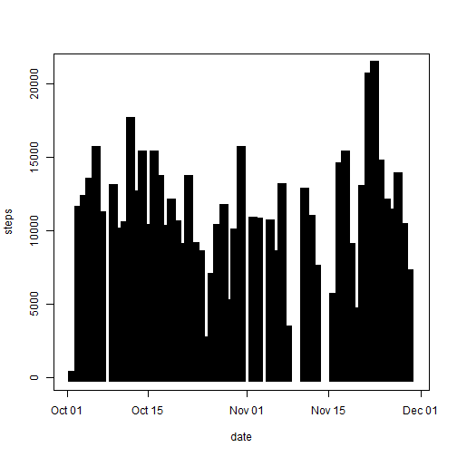
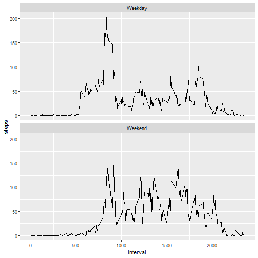

Course Project 1
==================

##Importing libraries

```r
library(tidyverse)
```

```
## -- Attaching packages --------------------------------------- tidyverse 1.2.1 --
```

```
## v ggplot2 3.0.0     v purrr   0.2.5
## v tibble  1.4.2     v dplyr   0.7.6
## v tidyr   0.8.1     v stringr 1.3.1
## v readr   1.1.1     v forcats 0.3.0
```

```
## -- Conflicts ------------------------------------------ tidyverse_conflicts() --
## x dplyr::filter() masks stats::filter()
## x dplyr::lag()    masks stats::lag()
```

##Reading Data


```r
activity <- read.csv("activity.csv")
```

##Counting total number of steps per day


```r
steps_per_day <- activity %>% group_by(date) %>% summarise(sum(steps, na.rm = TRUE))
steps_per_day$date <- as.Date(steps_per_day$date, format="%Y-%m-%d")
```

##Plotting histogram of number of steps per day


```r
plot(steps_per_day, type = "h", lwd = 10, lend = "square", ylab="steps")
```



##Mean of steps taken per day

```r
mean(steps_per_day$`sum(steps, na.rm = TRUE)`)
```

```
## [1] 9354.23
```

##Median of steps taken per day

```r
median(steps_per_day$`sum(steps, na.rm = TRUE)`)
```

```
## [1] 10395
```

##Time series plot of the 5-minute interval and the average number of steps taken, averaged across all days


```r
steps_per_int_avg <- activity %>% group_by(interval) %>% summarise(mean(steps, na.rm = TRUE))
plot(steps_per_int_avg, type = "l", ylab="steps")
```


##5-minute interval, on average across all the days in the dataset which contains the maximum number of steps


```r
filter(steps_per_int_avg, steps_per_int_avg$`mean(steps, na.rm = TRUE)`==max(steps_per_int_avg$`mean(steps, na.rm = TRUE)`))
```

```
## # A tibble: 1 x 2
##   interval `mean(steps, na.rm = TRUE)`
##      <int>                       <dbl>
## 1      835                        206.
```

##Total number of observations with missing values


```r
sum(is.na(activity$steps))
```

```
## [1] 2304
```

##Putting 0 in place of NA


```r
activity_new <- activity
activity_new$steps<- ifelse(is.na(activity_new$steps), 0, activity_new$steps)
```

##Plotting histogram of number of steps per day after imputing NA 


```r
steps_per_day_new <- activity_new %>% group_by(date) %>% summarise(sum(steps, na.rm = TRUE))
steps_per_day_new$date <- as.Date(steps_per_day_new$date, format="%Y-%m-%d")

plot(steps_per_day_new, type = "h", lwd = 10, lend = "square", ylab="steps")
```


##Mean of steps taken per day after imputing NA

```r
mean(steps_per_day_new$`sum(steps, na.rm = TRUE)`)
```

```
## [1] 9354.23
```

##Median of steps taken per day after imputing NA

```r
median(steps_per_day_new$`sum(steps, na.rm = TRUE)`)
```

```
## [1] 10395
```

###Mean and median did not change after imputing NA

##Creating new factor variable for weekday and weekend

```r
activity_new$date <- as.Date(activity_new$date, format="%Y-%m-%d")
activity_new <- mutate(activity_new, day = ifelse(weekdays(date) %in% c("Saturday", "Sunday"), "Weekend", "Weekday"))
```

##Making a panel plot containing a time series plot of the 5-minute interval (x-axis) and the average number of steps taken, averaged across all weekday days or weekend days

```r
steps_per_int_avg_new <- activity_new %>% group_by(interval, day) %>% summarise(mean(steps, na.rm = TRUE))
ggplot(data=steps_per_int_avg_new, mapping = aes(x=interval, y=`mean(steps, na.rm = TRUE)`))+facet_wrap(~day, nrow=2)+geom_line()+labs(y = "steps")
```


